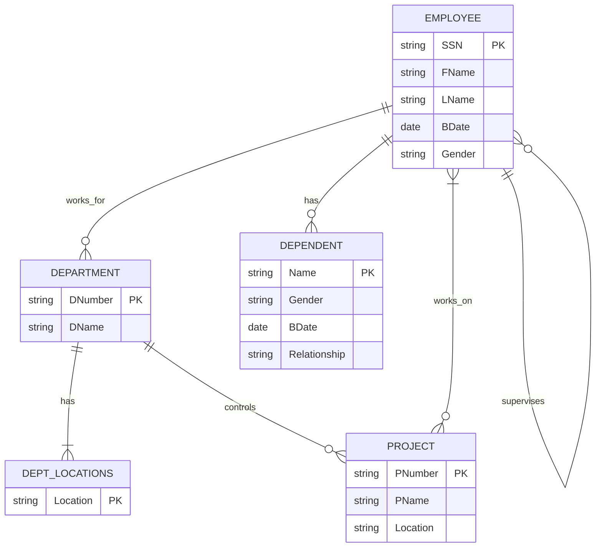

# ERD to Relational Schema Mapping Example

## Entity-Relationship Diagram (ERD)

## Mapping Process

1. **Identify strong entities:**
   - EMPLOYEE
   - DEPARTMENT
   - PROJECT
  

# ERD to Table Mapping Example

## Mapping Process

1. Identify strong entities and create tables for them.
2. Map weak entities.
3. Represent relationships.
4. Handle multi-valued attributes.

## Resulting Tables

### Employees (Strong Entity)

| SSN | FName | LName | BDate | Gender |
|-----|-------|-------|-------|--------|

Primary Key: SSN

### Departments (Strong Entity)

| DNumber | DName |
|---------|-------|

Primary Key: DNumber

### Department_Locations (Multi-valued Attribute)

| DeptNumber | Location |
|------------|----------|

Primary Key: (DeptNumber, Location)
Foreign Key: DeptNumber references Departments(DNumber)

### Projects (Strong Entity)

| PNumber | PName | Location | Controlling_Dept |
|---------|-------|----------|------------------|

Primary Key: PNumber
Foreign Key: Controlling_Dept references Departments(DNumber)

### Dependents (Weak Entity)

| SSN | Name | Gender | BDate | Relationship |
|-----|------|--------|-------|--------------|

Primary Key: (SSN, Name)
Foreign Key: SSN references Employees(SSN)

### Works_On (Relationship)

| SSN | PNumber | Hours |
|-----|---------|-------|

Primary Key: (SSN, PNumber)
Foreign Keys:
- SSN references Employees(SSN)
- PNumber references Projects(PNumber)

## Notes on Mapping

1. **Strong Entities**: Directly mapped to tables (Employees, Departments, Projects).
2. **Multi-valued Attributes**: Create a separate table (e.g., Department_Locations).
3. Weak Entities: Create a separate table (Dependents) with a composite primary key.
4. **Relationships**: 
   - One-to-Many: Add foreign key to the "many" side (e.g., Controlling_Dept in Projects).
   - Many-to-Many: Create a new table (e.g., Works_On).

This mapping process transforms the conceptual ERD into a relational schema that can be implemented in a relational database management system.
